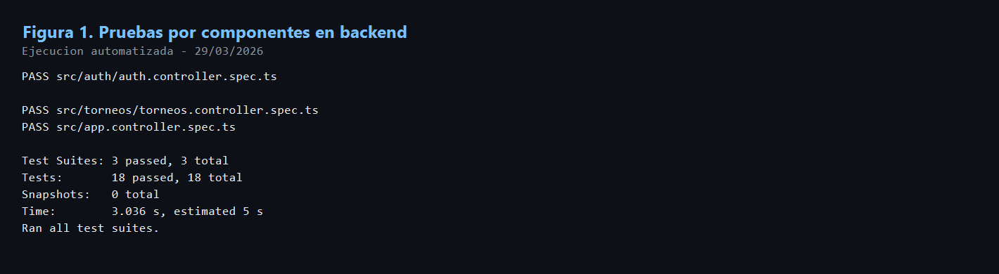
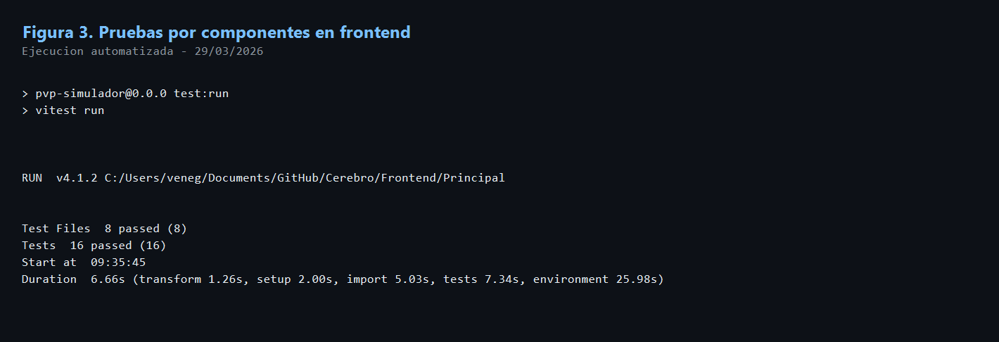
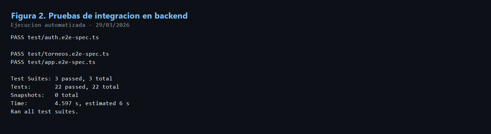

# Informe De Estrategia Y Evidencia De Pruebas

## Modulos Evaluados

- `Auth`
- `Torneos`

## Fecha De Ejecucion

- `29 de marzo de 2026`

## 1. Estrategia De Verificacion

Con el fin de verificar que el sistema funciona correctamente y cumple los requerimientos funcionales definidos para los modulos de `Auth` y `Torneos`, se establecio una estrategia de validacion en tres niveles: pruebas por componentes, pruebas de integracion y pruebas de usabilidad. En esta fase del proyecto se ejecutaron y documentaron las pruebas correspondientes a los dos primeros niveles. Las pruebas de usabilidad quedan planificadas para una etapa posterior, ya que requieren la participacion de usuarios reales y observacion directa de su interaccion con la aplicacion.

La estrategia aplicada busca comprobar tanto el funcionamiento aislado de cada componente como la correcta colaboracion entre controladores, rutas, guards, validaciones, servicios y vistas del frontend.

## 2. Pruebas Por Componentes

### 2.1 Objetivo

Las pruebas por componentes tienen como objetivo validar el comportamiento aislado de unidades funcionales del sistema, tanto en backend como en frontend. Estas pruebas permiten confirmar que cada componente procesa correctamente entradas validas, rechaza entradas invalidas, delega las operaciones al servicio correspondiente y muestra mensajes coherentes al usuario.

### 2.2 Metodologia

- En backend se utilizaron pruebas unitarias con `Jest`.
- En frontend se utilizaron pruebas de componentes con `Vitest` y `React Testing Library`.
- Se evaluaron controladores, paginas y componentes clave de los flujos de autenticacion y torneos.

### 2.3 Criterios De Exito

- El componente acepta entradas validas y produce la respuesta esperada.
- El componente rechaza entradas invalidas antes de ejecutar la logica principal.
- La accion se delega correctamente al servicio o API correspondiente.
- Los mensajes de error o exito son visibles y coherentes.
- La interfaz representa correctamente el estado esperado segun el contexto del usuario.

### 2.4 Casos Representativos Evaluados

#### Auth

- Inicio de sesion con credenciales validas e invalidas.
- Registro de usuario.
- Verificacion de correo.
- Solicitud de recuperacion de contrasena.
- Restablecimiento de contrasena.
- Cierre de sesion.
- Verificacion de token.
- Consulta de usuarios autenticados.

#### Torneos

- Listado de torneos publicos y autenticados.
- Creacion de torneo `SERIE`.
- Union a torneo mediante codigo.
- Cambio de estado del torneo.
- Visualizacion de ranking publico.
- Render de paginas de listado, formulario y detalle del torneo.

### 2.5 Evidencia De Ejecucion

Backend por componentes:

- Comando ejecutado: `npx jest --runInBand`
- Resultado: `3 suites`, `18 pruebas`, `0 fallos`

**Figura 1.** Ejecucion exitosa de pruebas por componentes en backend para los modulos `Auth` y `Torneos`.

Frontend por componentes:

- Comando ejecutado: `npm run test:run`
- Resultado: `8 archivos`, `16 pruebas`, `0 fallos`

**Figura 2.** Ejecucion exitosa de pruebas por componentes en frontend para los modulos `Auth` y `Torneos`.

## 3. Pruebas De Integracion

### 3.1 Objetivo

Las pruebas de integracion tienen como proposito verificar la interaccion entre componentes y servicios del sistema. En particular, se busco validar la colaboracion entre rutas HTTP, validaciones, guards de autenticacion, controladores y servicios del backend, comprobando que los flujos completos funcionen de forma consistente.

### 3.2 Metodologia

- Se utilizaron pruebas `e2e` con `Jest` y `Supertest`.
- Se evaluaron endpoints reales de los modulos `Auth` y `Torneos`.
- Se verificaron tanto flujos exitosos como manejo de errores ante entradas invalidas o intentos de acceso no permitidos.

### 3.3 Criterios De Exito

- Cada endpoint responde con el codigo HTTP esperado.
- Las validaciones bloquean payloads invalidos antes de llegar al servicio.
- Las rutas protegidas exigen autenticacion.
- Los flujos exitosos recorren correctamente controlador, validacion y servicio.
- Los errores son manejados de forma controlada, sin comprometer la estabilidad del sistema.

### 3.4 Flujos Completos Evaluados

#### Auth

- `login`
- `refresh`
- `signup`
- `verify-email`
- `forgot-password`
- `reset-password`
- `verify-token`
- `users`
- `logout`

#### Torneos

- Listado publico.
- Detalle publico.
- Ranking publico.
- Creacion autenticada de torneo.
- Union a torneo mediante codigo.
- Cambio de estado del torneo.
- Rechazo de solicitudes invalidas.

### 3.5 Evidencia De Ejecucion

Backend integracion:

- Comando ejecutado: `npx jest --config ./test/jest-e2e.json --runInBand`
- Resultado: `3 suites`, `22 pruebas`, `0 fallos`

**Figura 3.** Ejecucion exitosa de pruebas de integracion en backend para los modulos `Auth` y `Torneos`.

## 4. Pruebas De Usabilidad

Las pruebas de usabilidad no se presentan en este documento como evidencia ejecutada, ya que requieren sesiones controladas con usuarios reales o participantes externos. Esta fase se desarrollara posteriormente para evaluar facilidad de uso, claridad de flujos, tiempos de completitud de tareas y nivel de satisfaccion del usuario.

## 5. Conclusion

Con base en la evidencia obtenida, se concluye que los modulos `Auth` y `Torneos` cumplen satisfactoriamente con los escenarios funcionales principales definidos para esta fase del proyecto. Las pruebas por componentes confirmaron el funcionamiento correcto de las unidades evaluadas de manera aislada, mientras que las pruebas de integracion validaron la correcta interaccion entre rutas, validaciones, guards y servicios del backend. En consecuencia, el sistema presenta un comportamiento consistente y estable en los casos cubiertos por esta estrategia de pruebas.

